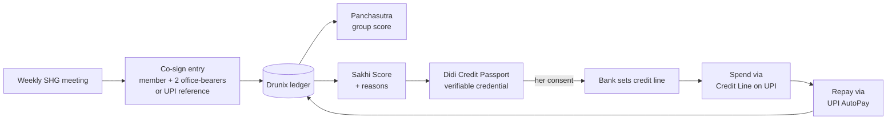

# SakhiLedger

**From group trust to personal credit.**
A consent-based credit passport for India's self-help group (SHG) women, built on NPCI's **Drunix** blockchain and connected to **Credit Line on UPI**.

> **Her record. Her credit. Her choice.**

DRUNIX Hackathon 2026 (NPCI × Citi) · Problem Statement 4: **Financial Inclusion**

> ⚠️ **Prototype.** Hackathon build using synthetic data and sandbox/mocked payment rails. Not a regulated financial product and not affiliated with NPCI beyond hackathon participation.

---

## Table of contents

1. [The problem](#the-problem)
2. [Our solution](#our-solution)
3. [How it works](#how-it-works)
4. [Why Drunix](#why-drunix)
5. [NPCI rails used](#npci-rails-used)
6. [Tech stack](#tech-stack)
7. [Repository structure](#repository-structure)
8. [Getting started](#getting-started)
9. [Demo script](#demo-script)
10. [Security and privacy](#security-and-privacy)
11. [Roadmap](#roadmap)
12. [Team](#team)
13. [License](#license)

Detailed design: **[ARCHITECTURE.md](./ARCHITECTURE.md)**

---

## The problem

India's 10 crore+ SHG women are one of the most reliable borrower groups anywhere, yet most of them have **no individual credit history**.

| Fact | Source |
|---|---|
| ~10 crore women in ~91–94 lakh SHGs | DAY-NRLM / PIB |
| ₹11 lakh crore bank credit raised at ~1.7% NPA | DAY-NRLM |
| Govt target: ₹1 lakh crore in **individual** loans to SHG women over 5 years | MoRD, Sep 2026 |
| Credit Line on UPI for SHG women launched in 2026, but at a **flat ₹5,000** for everyone | Bank of Baroda × NPCI pilot |
| 18% of Indian women's bank accounts are inactive (vs 11% for men) | World Bank Findex 2025 / CGAP |

**Why the data doesn't exist**

- **Group lending hides the individual.** Bank loans go to the group, not the member.
- **Internal lending is invisible.** Members' borrowing from their own SHG is not recorded anywhere a bank can use (NABARD).
- **The reporting rule exists, the data doesn't flow.** RBI has required member-level SHG credit reporting since 2016.
- **Records are single-writer.** LokOS digitises SHG books, but bookkeepers enter the data and block staff approve it. Members can't verify it and banks can't independently trust it.
- **So limits stay flat.** Without a trusted per-woman signal, every member gets the same ₹5,000.

---

## Our solution

SakhiLedger makes **the SHG meeting itself the source of verified credit data**.

1. **Record together.** Savings, internal loans and repayments are co-signed by the member and her group on a shared Drunix ledger.
2. **Score with reasons.** An explainable model produces a *Sakhi Score* and a recommended limit, with reasons in Tamil or Hindi.
3. **Share by choice.** The woman decides which bank sees her **Didi Credit Passport** and can revoke access at any time.
4. **Grow.** The bank sizes her **Credit Line on UPI** from her real record. Each repayment flows back to the ledger and raises her limit: a credit ladder.

**What's new**

- Turns member-attested SHG meeting records into **individual, portable, bank-verifiable** credit data.
- Moves Credit Line on UPI from **flat to risk-based** limits, extending NPCI's own 2026 pilot.
- **Complements LokOS** (imports its data, adds the trust layer) instead of replacing it.
- Built for low literacy and low smartphone access: **voice-first, offline-capable, shared-device, Bank Sakhi assisted**.

---

## How it works



| Step | What happens |
|---|---|
| 1. Meeting | Transactions are entered on a shared SHG tablet or by a Bank Sakhi. |
| 2. Attestation | UPI entries are auto-verified by payment reference. Cash entries need a quorum: the member plus 2 office-bearers. |
| 3. Ledger | Chaincode validates the entry, writes it to Drunix and updates the group's **Panchasutra** score (meetings, savings, internal lending, repayment, books). |
| 4. Score | The scoring service computes a Sakhi Score and a recommended limit with SHAP reason codes. |
| 5. Passport | The credential service issues or refreshes the **Didi Credit Passport** and anchors its hash on Drunix. |
| 6. Consent | The member grants a bank time-bound, purpose-specific access. She can revoke it in one tap. |
| 7. Credit | The bank verifies the passport and sets her credit line (e.g. ₹5,000 → ₹15,000). |
| 8. Ladder | Repayments are written back to the ledger, so her passport and limit improve. |
| 9. Peer vouching | Members can vouch for each other's limit increase. Vouches are capped and carry a small risk for the voucher. |

---

## Why Drunix

Drunix is NPCI's open-source enterprise blockchain, an enhanced fork of Hyperledger Fabric.

- **Several organisations must trust one record.** The SHG federation, the bank and the State Rural Livelihood Mission (SRLM) all run peers, and the women are co-signers.
- **Nobody can quietly edit history**, including the bookkeeper.
- **Endorsement rules mirror SHG rules.** Loan-linked records need both federation and bank sign-off.
- **Private data stays private.** Member personal data lives in private data collections or off-chain; only hashes and events go on the shared ledger.
- **SQL state database.** Dashboards can query ledger state directly.
- **Horizontal scaling** for a national rollout (one channel per federation or state).

---

## NPCI rails used

| Rail | Use in SakhiLedger | Prototype status |
|---|---|---|
| **Credit Line on UPI** | Sanction, merchant spend, repayment (core rail) | Mocked until NPCI API access |
| **UPI Pay + payment-reference callbacks** | Auto-verify savings and repayments | Payment-aggregator sandbox |
| **UPI AutoPay** | Credit-line repayment | Sandbox |
| **UPI Reserve Pay** | Block once, debit weekly savings (supports credit lines) | Mocked |
| **AePS three-party cash deposit** | Cash savings into the SHG account via a Bank Sakhi | Mocked |
| **Account Aggregator** | Optional features from members' bank account flows | Sandbox |
| **UPI Circle**, **Unified Agent Protocol** | Treasurer spending; AI assistant that pays dues | Roadmap |

All rails sit behind one **UPI adapter** with a `mock | sandbox | npci` switch, so the demo never depends on external access.

**Licence and access flags**

- Live UPI needs a sponsor PSP bank.
- Aadhaar authentication needs an AUA/KUA licence. We reuse the bank's existing KYC and mock OTP in the prototype.
- Reserve Pay needs the SHG onboarded as a merchant, and UPI Circle needs UPI enabled on SHG group accounts.

---

## Tech stack

| Layer | Choice |
|---|---|
| Ledger | NPCI Drunix (Hyperledger Fabric fork), Go chaincode, Raft ordering |
| API gateway | Node.js + TypeScript, Fabric Gateway SDK |
| Scoring | Python, FastAPI, XGBoost (monotonic constraints), SHAP |
| Data | PostgreSQL (off-chain app data), Redis (queues, sessions) |
| Frontend | React + Vite PWA, Tailwind CSS, IndexedDB offline sync |
| Voice | Bhashini speech-to-text / text-to-speech (Tamil, Hindi) |
| Credentials | W3C Verifiable Credentials (JWT, Ed25519), hash anchored on Drunix |
| Security | Fabric CA/MSP, mutual TLS, WebCrypto device keys, HashiCorp Vault, OWASP ASVS L2 |
| Payments | UPI adapter: mock / payment-aggregator sandbox / NPCI APIs |
| DevOps | Docker Compose, GitHub Actions, AWS EC2 (demo), Prometheus + Grafana |

---

## Repository structure

```
sakhiledger/
├── network/            # Scripts for the Drunix test network (drunix/ clone and keys are git-ignored)
├── chaincode/sakhi/    # Go chaincode: ledger, quorum attestation, Panchasutra, passport, vouching, consent
├── gateway/            # Node/TS REST API + Fabric Gateway client + event listener
├── services/
│   ├── scoring/        # FastAPI scoring service, model, SHAP, synthetic data generator
│   ├── voice/          # Bhashini wrapper
│   └── upi-adapter/    # mock / sandbox / npci payment rails
├── apps/
│   ├── member-pwa/     # Member + Bank Sakhi app (offline-first, Tamil/Hindi)
│   └── bank-console/   # Credit-officer and SRLM dashboards
├── credentials/        # Passport credential schemas, issuer and verifier
├── docs/               # Threat model, DPDP mapping, API spec, decisions
├── data/synthetic/     # Synthetic SHG data generator and seeds
├── .github/workflows/  # CI
├── docker-compose.yml
├── README.md
└── ARCHITECTURE.md
```

> 🔐 **Never commit** `drunix/`, `crypto-config/`, `organizations/` or any MSP/TLS key material. The Drunix test network generates real private keys on your machine.

---

## Getting started

> Status: scaffolding in progress. Commands below are the target workflow; owners will fill in scripts as modules land.

### Prerequisites

- Docker + Docker Compose (Windows: Docker Desktop with **WSL2**)
- Go 1.22+, Node.js 20+, Python 3.11+
- Git, make

### 1. Clone

```bash
git clone https://github.com/<your-org>/sakhiledger.git
cd sakhiledger
git clone https://github.com/npci/drunix.git drunix   # vendor clone, git-ignored
cp .env.example .env
```

### 2. Start the ledger

```bash
./network/net.sh up          # start Drunix test network (3 orgs + orderer)
./network/net.sh deploy-cc   # package, approve and commit chaincode/sakhi
```

### 3. Start services and apps

```bash
docker compose up -d postgres redis
docker compose up -d gateway scoring upi-adapter voice
docker compose up -d member-pwa bank-console
```

### 4. Seed demo data

```bash
python data/synthetic/generate.py --clf 1 --shgs 20 --months 24
python data/synthetic/seed.py
```

| App | URL |
|---|---|
| Member PWA | http://localhost:5173 |
| Bank console | http://localhost:5174 |
| Gateway API | http://localhost:8080 |
| Scoring API | http://localhost:8090/docs |

Set `UPI_MODE=mock` in `.env` for offline demos.

---

## Demo script

About 4 minutes, all running on one laptop.

1. **Setup.** The bank console shows member *Lakshmi* at a flat ₹5,000 limit.
2. **Meeting.** A ₹100 UPI savings payment is auto-verified. A cash repayment gets 3 approvals on phones, and the new block appears.
3. **Tamper attempt.** Edit an old entry in the off-chain database. The console flags a hash mismatch.
4. **Voice.** Lakshmi asks her limit in Tamil and hears the answer.
5. **Consent and decision.** She shares her passport. The officer sees the score and reasons, then raises the limit to ₹15,000.
6. **Spend.** She pays a kirana QR from the credit line.
7. **Revoke.** She revokes consent and the bank loses access instantly.

Backup: recorded demo video + `UPI_MODE=mock` + pre-seeded data.

---

## Security and privacy

- **Personal data off-chain.** Names, phone numbers and KYC references never go on the shared ledger. The ledger holds salted hashes and pseudonymous IDs.
- **Purgeable private data** supports the DPDP right to erasure.
- **Consent first.** Purpose-specific, time-bound and revocable. Credit limits never increase without the member's explicit yes.
- **Anti-collusion.** Cash entries need a quorum, are weighted lower than UPI-verified entries, and are checked by anomaly detection.
- **Tamper evidence.** Every off-chain record carries a hash checked against the ledger.
- **Key hygiene.** Fabric MSP identities, mutual TLS, Vault for secrets, device-bound keys for members.
- **DPDP timeline.** Consent Manager framework from 13 Nov 2026; full compliance by 13 May 2027.

Details: [ARCHITECTURE.md → Security](./ARCHITECTURE.md#9-security-and-privacy).

---

## Roadmap

- [ ] **Week 1:** Drunix network up, data model, wireframes, synthetic data, SHG field interviews
- [ ] **Week 2:** Chaincode core, gateway API, PWA core screens
- [ ] **Week 3:** UPI adapter, credit-line and AutoPay flows, scoring v1, passport issue/verify
- [ ] **Week 4:** Bank console, consent, voice, vouching, offline sync
- [ ] **Week 5:** Threat model, pen-test, tamper demo, load test
- [ ] **Week 6:** Pitch polish, backup video, dry runs

**After the hackathon:** pilot with 1 bank + 1 cluster federation near Vellore, LokOS import, UPI Circle for treasurers, Unified Agent Protocol for auto-paid dues.

---

## Team

| Name | Role | GitHub |
|---|---|---|
| [NAME] | Blockchain lead | @handle |
| [NAME] | Backend lead | @handle |
| [NAME] | Frontend lead | @handle |
| [NAME] | AI/ML lead | @handle |
| [NAME] | Security & research lead | @handle |

Role split and ownership are proposed in [ARCHITECTURE.md → Work split](./ARCHITECTURE.md#13-proposed-work-split) and open for discussion.

---

## License

Apache-2.0, matching Drunix.

**Acknowledgements:** NPCI (Drunix), Citi, DAY-NRLM and NABARD public data, Bhashini.
